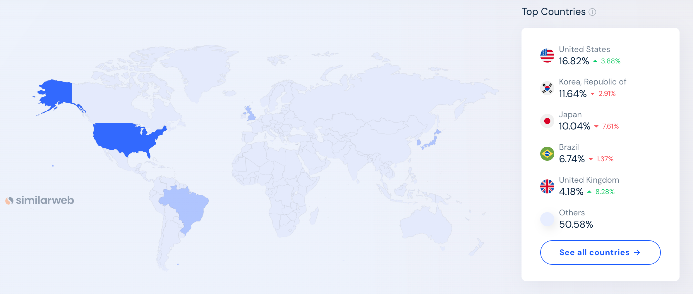
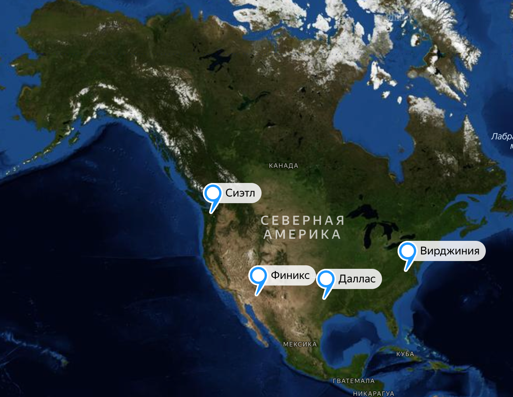
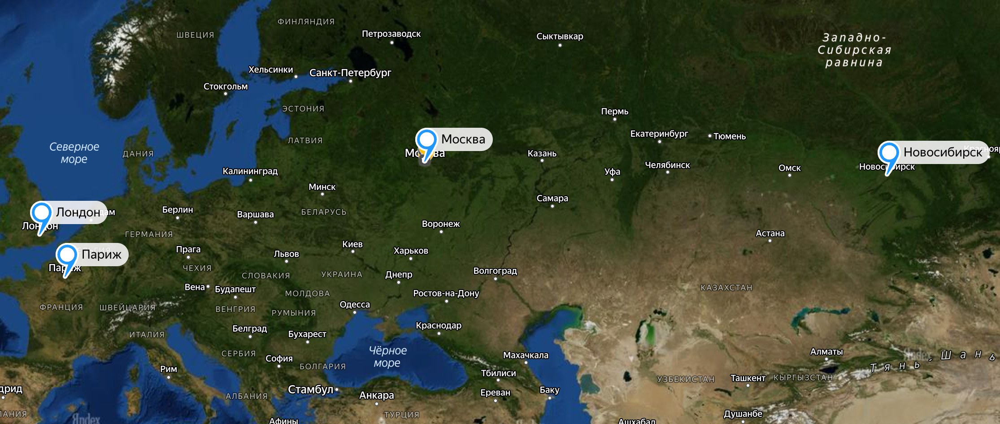
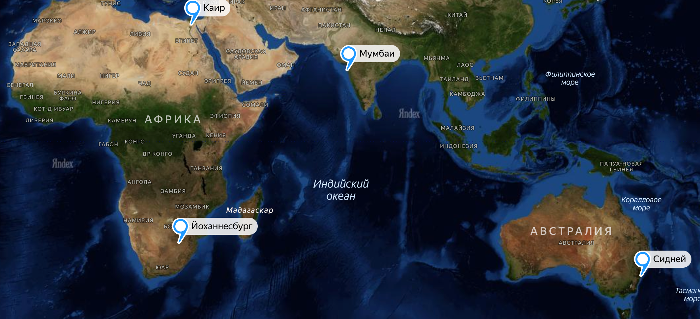
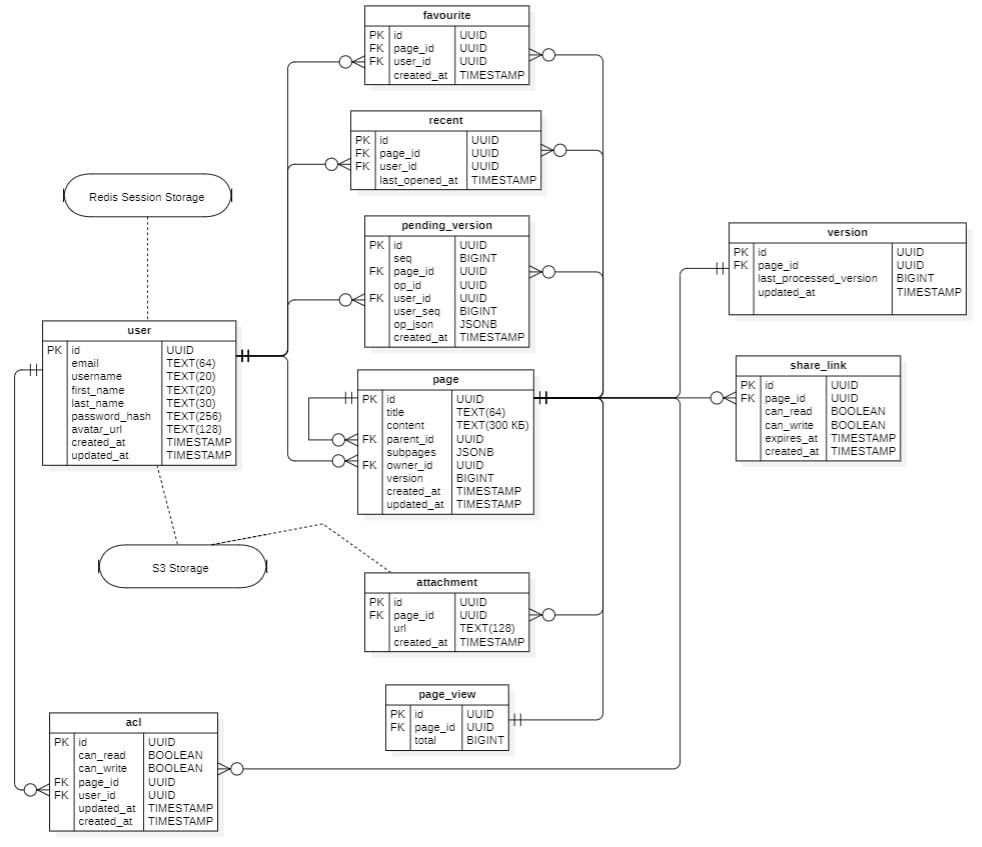
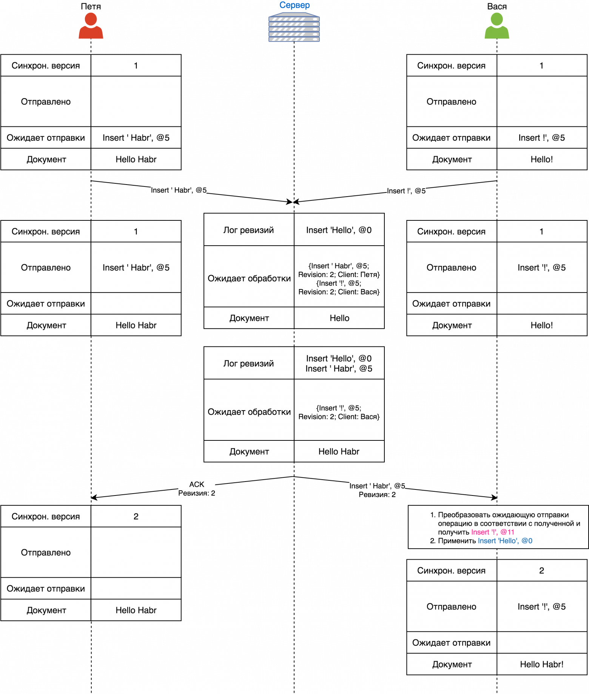
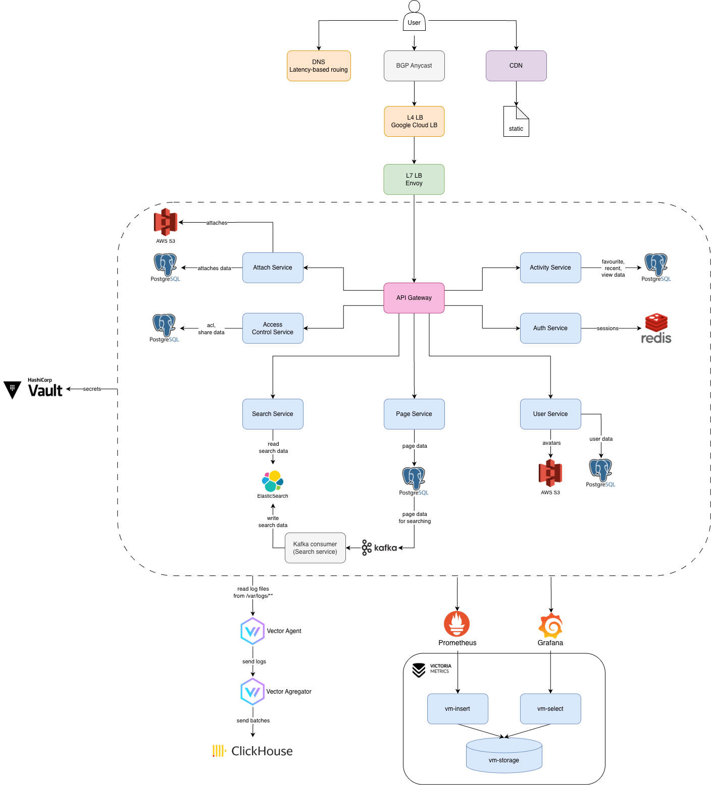
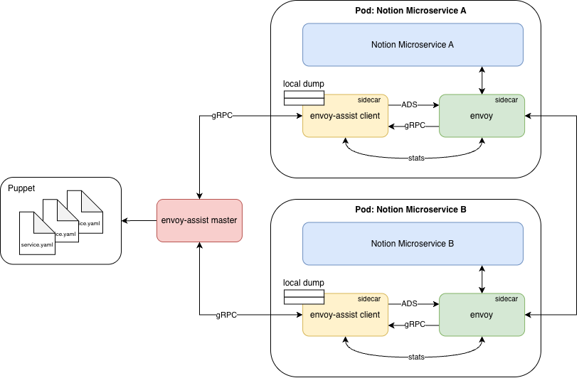

# Проектирование высоконагруженных систем
## Notion

## Содержание
[1. Тема и целевая аудитория](#1-тема-и-целевая-аудитория)

[2. Расчет нагрузки](#2-расчет-нагрузки)

[3. Глобальная балансировка нагрузки](#3-глобальная-балансировка-нагрузки)

[4. Локальная балансировка нагрузки](#4-локальная-балансировка-нагрузки)

[5. Логическая схема БД](#5-логическая-схема-бд)

[6. Физическая схема БД](#6-физическая-схема-бд)

[7. Алгоритмы](#7-алгоритмы)

[8. Технологии](#8-технологии)

[9. Обеспечение надежности](#9-обеспечение-надежности)

## 1. Тема и целевая аудитория
Notion - это сервис для создания заметок и текстовых документов, канбан-карт, гибких баз данных и баз знаний, трекинга задач и управления проектами.

### Функционал MVP:
- авторизация
- профиль пользователя
- главная страница
- создание и редактирование контента
- поиск по страницам
- недавние и избранные страницы
- вложенные страницы с иерархией
- прикрепление вложений
- ACL, права доступа
- шеринг по ссылке/почте
- количество просмотров страницы

### Целевая аудитория
По данным сайта [hypestat](https://hypestat.com/info/notion.so) Notion имеет следующие метрики:
- более 5 млн уникальных пользователей в день (DAU)
- более 25 млн уникальных пользователей в месяц (MAU) и 170 млн сессий в месяц (~7 визитов на пользователя)
- около 20% пользователей заходят в сервис ежедневно (stickness, DAU/MAU)
- среднее время сессии пользователя - 9 минут
- в среднем пользователь за сессию просматривает около 10 страниц
- bounce rate сервиса - около 25% пользователей покидают сайт, не совершая никаких взаимодействий

## Анализ аудитории

#### География пользователей


#### Устройства пользователей


## 2. Расчет нагрузки

По данным сайта [hypestat](https://hypestat.com/info/notion.so) значение DAU равно 5 млн, MAU - 25 млн.

### Расчет объема сохраняемых данных
В 2024 году [Notion](https://www.notion.com/blog/100-million-of-you) достиг отметки 100 млн пользователей. Исходя из этого можно оценить объем сохраняемых данных.
В расчетах я предполагаю, что Notion прибавляет +0.5 млн пользователей в месяц. Это дает примерно:

$$
\frac{500\,000}{30} \approx 16\,667\ \text{новых пользователей в день}
$$

**Прирост в день (единицы):**

$$
\text{ед/день} =
\text{ед/пользователя} \times \text{новых пользователей в день}
$$

**Прирост в день (объем):**

$$
\text{объем/день} =
\text{ед/день} \times \text{средний размер единицы}
$$


**Прирост в месяц (единицы):**

$$
\text{ед/мес} =
\text{ед/пользователя} \times \text{новых пользователей в месяц}
$$


**Прирост в месяц (объем):**

$$
\text{объем/мес} =
\text{ед/мес} \times \text{средний размер единицы}
$$

| Хранимые данные         | Средний размер единицы | Ед/пользователя | Сколько единиц | Суммарный объем | Прирост в день | Прирост в месяц |
|-------------------------|------------------------|:---------------:|----------------|-----------------|----------------|-----------------|
| профиль пользователя    | 300 КБ                 |        1        | 100 млн        | 30 ТБ           | 5 ГБ           | 135 ГБ          |
| страницы (без вложений) | 200 КБ (~25k слов)     |       10        | 1 млрд         | 200 ТБ          | 33 ГБ          | 1.0 ТБ          |
| вложения                | 1 МБ                   |       40        | 4 млрд         | 4 ПБ            | 0.68 ТБ        | 20 ТБ           |
| **Итого**               | —                      |        —        | —              | **4.23 ПБ**     | **0.72 ТБ**    | **21 ТБ**       |

Суммарный объем данных составляет 4230 Тб, из которых 4000 Тб - хранилище вложений.

### Расчет среднего количества действий пользователя в день и RPS
Публичных данных по действиям пользователя в день нет, поэтому я опираюсь на свой опыт использования Notion и агрегированные метрики с [hypestat](https://hypestat.com/info/notion.so). Пользователь в среднем просматривает ~9.5 страниц за сессию. Примем, что у пользователя примерно 4 сессии в день, тогда в среднем это около 38 страниц в день. Эти страницы формируются из нескольких типов действий:
- **посещение домашней страницы** — точка входа, где отображаются список собственных страниц, недавние и избранные;
- **поиск по страницам** — часть навигации, которая открывает нужный документ;
- **просмотры контента** — собственно загрузка страниц с данными и вложениями, кроме домашней.

Для расчета RPS будем использовать формулу

$$RPS = \frac{\text{среднее действий в день на пользователя} \times DAU}{86\,400}$$

| Действие                                              | Среднее в день на пользователя |  RPS |
|-------------------------------------------------------|:------------------------------:|-----:|
| посещение домашней страницы                           |              12                |  694 |
| создание страницы                                     |               1                |   58 |
| поиск страниц                                         |              6.5               |  376 |
| регистрация/авторизация                               |              0.1               |    6 |
| редактирование страницы (автосохранение – 5 сек, 15 мин) |            180              | 10417|
| просмотр страницы                                     |              30                | 1736 |
| прикрепление вложений                                 |              2.5               |  145 |
| изменение прав доступа (ACL)                          |              0.6               |   35 |
| профиль пользователя                                  |              0.2               |   12 |
| шеринг по ссылке/почте                                |              0.4               |   23 |
| инкремент просмотров страницы                         |              30                | 1736 |
| получение медиа контента                              |              120               | 6944 |

Получаем средний RPS: 22182

### Расчет сетевого трафика

Для оценки сетевой нагрузки можно ориентироваться на замеры в инструментах разработчика браузера (DevTools). Суммарную нагрузку на сеть считаем по формуле:

$$
\text{Нагрузка [Гбит/с]} =
\frac{\text{средний трафик на действие [КБ]} \times RPS \times 8}
{1024 \times 1024}
$$

| Действие                                   | КБ на действие |   RPS  | Нагрузка (Гбит/с) | Нагрузка (Гбит/день) |
|--------------------------------------------|:--------------:|------:|------------------:|---------------------:|
| посещение домашней страницы                |      550       |   694 |             2.91  |            251 609   |
| создание страницы                          |       50       |    58 |             0.02  |              1 912   |
| поиск страниц                              |      370       |   376 |             1.06  |             91 705   |
| регистрация/авторизация                    |       80       |     6 |             0.00  |                316   |
| редактирование страницы (автосохранение)   |       50       | 10 417|             3.97  |            343 334   |
| просмотр страницы                          |      350       | 1 736 |             4.64  |            400 518   |
| прикрепление вложений                      |      100       |   145 |             0.11  |              9 558   |
| изменение прав доступа (ACL)               |       30       |    35 |             0.01  |                692   |
| профиль пользователя                       |       10       |    12 |             0.00  |                 79   |
| шеринг по ссылке/почте                     |       80       |    23 |             0.01  |              1 213   |
| инкремент просмотров страницы              |       1        |  1736 |            0.0133 |               1,145  |
| получение медиа контента                   |       8        |  6944 |            0.4283 |              36 616  |

$$
\text{Средняя нагрузка на сеть} \approx 13.18\ \text{Гбит/с}
$$

$$
\text{Суточная нагрузка на сеть} =
13.18 \times 86\,400 \approx 1\,100\,936\ \text{Гбит/день}
\approx 139\ \text{ТБ/день}
$$

$$
\text{Трафик на пользователя в день} =
12 \times 550 +
1 \times 50 +
6.5 \times 370 +
0.1 \times 80 +
180 \times 50 +
30 \times 350 +
2.5 \times 100 +
0.6 \times 30 +
0.2 \times 10 +
0.4 \times 80 +
120 \times 8 
$$

$$
\approx 11{,}000\ \text{КБ/день}
\approx 0.084\ \text{Гбит/день на пользователя}
$$

**Пиковый коэффициент**

Пиковый коэффициент показывает, во сколько раз пиковая нагрузка превышает среднюю:

$$
k_{\text{пик}} = \frac{\text{Пиковая нагрузка}}{\text{Средняя нагрузка}}
$$

Сделаем допущение: поскольку Notion — это B2B SaaS-сервис, примем

$$
k_{\text{пик}} = 2
$$

Тогда:

$$
\text{Пиковая нагрузка} =
\text{Средняя нагрузка} \times k_{\text{пик}}
= 13.18 \times 2 \approx 26.4\ \text{Гбит/с}
$$

**Коэффициент надежности**

Коэффициент надежности показывает, какой запас ресурсов закладывается в системе:

$$
k_{\text{надежн}} = \frac{\text{Доступные ресурсы}}{\text{Необходимые ресурсы}}
$$

Для критичного сервиса уровня Notion примем

$$
k_{\text{надежн}} = 1.25
$$

Тогда:

$$
\text{Нагрузка с резервом} =
\text{Пиковая нагрузка} \times k_{\text{надежн}}
= 26.4 \times 1.25 \approx 33\ \text{Гбит/с}
$$

## 3. Глобальная балансировка нагрузки
Глобальная балансировка нагрузки — это распределение трафика между несколькими географически разнесенными дата-центрами.

Для размещения дата-центров использовалась статистика по распределению пользователей (см. [пункт 1](#1-тема-и-целевая-аудитория)). Наибольшая доля аудитории сосредоточена в США, Южной Корее, Японии, Бразилии и странах Европы. Поэтому ЦОДы расположены в регионах с высокой концентрацией пользователей и развитой технологической инфраструктурой. Дополнительно при выборе городов учитывалась [карта плотности населения мира](https://luminocity3d.org/WorldPopDen/#3/20.00/10.00).


### 1. США
16.2% аудитории (≈1 млн DAU) находится в США. Это крупнейший рынок, поэтому здесь необходимо разместить несколько ЦОДов. Они распределяются по географии страны:  
- **Сиэтл** — северо-запад, технологический центр и крупный кластер облачных провайдеров (AWS, Azure, Google Cloud).  
- **Финикс и Даллас** — юго-запад и центр, регионы с низкой стоимостью электроэнергии и высокой концентрацией дата-центров.  
- **Вирджиния** — восточное побережье, крупнейший в мире хаб дата-центров (Ashburn).  

Такое распределение позволяет минимизировать задержки для пользователей по всей территории США



### 2. Южная Корея и Япония
На Корею (11.5%) и Японию (10.3%) суммарно приходится более 20% пользователей (≈1 млн DAU). Благодаря компактной территории, достаточно по одному ЦОДу в каждой стране:  
- **Сеул** — крупнейший технологический и сетевой центр Кореи.  
- **Токио** — основная агломерация Японии, откуда обеспечивается низкая задержка для всей страны.  

Дополнительно в регионе выбран **Пекин**: это позволяет обслуживать пользователей Китая и частично разгрузить трафик из Японии и Кореи.


### 3. Бразилия
Бразилия дает около 7% аудитории (≈350 тыс. DAU). Несмотря на огромную территорию страны, большая часть населения сосредоточена на атлантическом побережье. Поэтому логично разместить один ЦОД в **Сан-Паулу** — крупнейшем финансовом и технологическом центре региона. Этого достаточно, так как общее количество пользователей в Латинской Америке относительно невелико.


### 4. Европа и Россия
Франция (4.1%) и остальные страны Европы дают совокупно более 50% аудитории. Пользователи в Европе в основном концентрируются в столицах и крупных городах. Поэтому для покрытия региона выбраны:  
- **Лондон** — один из крупнейших европейских телеком-хабов.  
- **Париж** — столица Франции и важный дата-центр регионального уровня.  
- **Москва и Новосибирск** — для покрытия Восточной Европы и России. Несмотря на санкции, пользователи продолжают оставаться, поэтому для них логично оставить инфраструктуру в крупных городах.  




### 5. Южная Азия, Африка и Австралия
Хотя прямой статистики меньше, на эти регионы приходится значительная часть мирового населения. Чтобы обеспечить базовый уровень доступности для пользователей предлагается разместить ЦОДы в:  
- **Мумбаи** — крупнейший технологический и телеком-центр Индии.  
- **Каир** — важный хаб для Северной Африки и Ближнего Востока.  
- **Йоханнесбург** — основной телеком-центр Южной Африки.  
- **Сидней** — логичный выбор для Австралии и Океании.




Полную карту можно посмотреть по [ссылке](https://yandex.ru/maps/?um=constructor%3Ad36b173e069ce28964f230d783d100a1960bf874ec14b7b1728ffeba17027420&source=constructorLink)

Суммарно имеем 16 ЦОДов на 5 млн DAU.

В идеале каждый ЦОД должен: 
- обслуживать одинаковое среднее количество DAU: 5 000 000 / 16 = 312 500
- получать одинаковое среднее количество RPS: 22 182 / 16 = 1386.

С учетом того, что по факту на какие-то ЦОДы может ходить в 2 раза больше пользователей из-за их неравномерного распределения, а также с учетом пиковой нагрузки х2 от средней, имеем пиковую нагрузку на ЦОД: 1386 * 2 * 2 = 5545 RPS.


### CDN

Чтобы сократить время загрузки интерфейсов и статического контента, задействуем CDN. Сеть доставки контента кэширует изображения, скрипты и вложения на узлах, расположенных ближе к пользователю. Это уменьшает нагрузку на дата-центры и ускоряет работу сервиса.

### BGP Anycast

Для глобальной маршрутизации запросов в каждом регионе будет применяться BGP Anycast. Один и тот же IP-адрес будет анонсироваться из разных дата-центров, и с помощью маршрутизации автоматически направит пользователя в ближайший доступный узел. Это снижает сетевые задержки и повышает отказоустойчивость системы.

[BGP](https://asvk.cs.msu.ru/~sveta/8-2-BGP.pdf) (Border Gateway Protocol) — это протокол маршрутизации, предназначенный для обмена информацией о сетях между автономными системами (AS). Автономная система — это совокупность маршрутизаторов, находящихся под единым административным управлением и использующих общую внутреннюю политику маршрутизации (например, сеть провайдера или крупной организации). В отличие от внутренних протоколов маршрутизации, которые ориентируются в основном на количественные метрики (например, длину пути в количестве переходов), BGP реализует так называемый path-vector-подход: каждый анонс маршрута сопровождается набором атрибутов, которые описывают свойства пути и позволяют принимать решения в соответствии с политиками конкретной автономной системы.

Выбор маршрута в BGP опирается на несколько ключевых атрибутов: weight, LOCAL_PREF, AS_PATH, ORIGIN, MED, NEXT_HOP, ATOMIC_AGGREGATE, AGGREGATOR.

Anycast — сетевая технология, при которой один IP-адрес назначается нескольким серверам. В отличие от Multicast или Broadcast, пакет, направленный на этот IP адрес, дойдет не до всех серверов, а до одного.

## 4. Локальная балансировка нагрузки
Локальная балансировка нагрузки работает внутри конкретного дата-центра и распределяет трафик между несколькими серверами или сервисами в одном месте.

После того как трафик попал в площадку, его принимает **Kubernetes Service**. Он выполняет роль L4-балансировщика, распределяя TCP/UDP-соединения между нодами, на которых запущены ingress-поды (с Envoy). Для этого используется встроенный kube-proxy, который опирается на актуальную информацию о нодах и подах из Kubernetes API.

Помимо балансировки, Kubernetes:
- автоматически перезапускает упавшие контейнеры, обеспечивая отказоустойчивость;
- распределяет и перераспределяет нагрузку между нодами за счет планировщика;
- является стандартом индустрии для управления контейнеризированными сервисами.

### Envoy

Для балансировки и маршрутизации на уровне приложений используется связка Envoy + Envoy Assist. Ingress-поды с Envoy принимают входящие HTTPS-соединения, терминируют SSL и анализируют HTTP-запросы. На основе конфигурации и алгоритма **least connections** Envoy выбирает backend-pod из пула доступных реплик.

### Envoy Assist

- собирает актуальную информацию о подах и сервисах;
- обновляет конфигурацию Envoy динамически, когда меняется количество реплик или состояние подов;
- обеспечивает стабильную и гибкую маршрутизацию без ручных правок конфигов.

### Терминация SSL

- терминация SSL выполняется на ingress Envoy — на границе кластера;
- дополнительно каждый микросервис принимает HTTPS-соединения, что дает сквозное шифрование и контроль соединений во внутренней сети.

## 5. Логическая схема БД



| Таблица             | Описание                                                                                                                                                                                                                                                                    |
| ------------------- | --------------------------------------------------------------------------------------------------------------------------------------------------------------------------------------------------------------------------------------------------------------------------- |
| **User**            | Хранит аккаунты пользователей: email/username, имя, хэш пароля, аватар (URL), даты создания/обновления. Используется как владелец страниц и субъект ACL.                                                                                                                    |
| **Session**         | Redis Session Storage: эфемерные сессии (`user_id`, `token`, `expires_at`). Для БД — только факт, что источник сессий Redis.                                                                                                                                                |
| **Page_Meta**       | Метаданные страницы: `title`, `parent_id`, **`subpages`** (JSONB-кэш вида `[{subpage_id, title}, …]` для быстрых списков), `owner_id`, `version` (последняя **материализованная** версия — до какого `seq` применен контент), `created_at/updated_at`. |
| **Page_Content**    | Материализованный контент страницы: `page_id` (PK=FK на `page_meta.id`), `content` (TEXT/JSON, хранит актуальное содержимое без вложений).                                                                                                                                  |
| **Version**         | Таблица версионирования **1-к-1** со `page_meta`: `last_processed_version` (голова журнала — последний выданный `seq`), `updated_at`. Используется для атомарного присвоения `seq` при приеме операции.                                                                     |
| **Pending_Version** | **Журнал принятых операций**: `(page_id, seq)` порядок, `op_id` (идемпотентность), `user_id` (автор), `user_seq` (версия клиента), `op_json` (JSONB) + `created_at`.                                                                                          |
| **Share_Link**      | Шеринг страницы по ссылке: `token` (внешняя ссылка), `can_read`, `can_write`, `expires_at`, `created_at`, `page_id`.                                                                                                                                                  |
| **Attachment**      | Метаданные вложений страницы: `page_id`, `url` (путь в объектном хранилище), `created_at`. Сами файлы — во внешнем **S3**.                                                                                                                                                  |
| **Media**           | S3 Storage (логическая сущность для блобов). В БД — только ссылка (`attachment.url`).                                                                                                                                                                                       |
| **ACL**             | Права доступа к страницам: для пары (`page_id`, `user_id`) хранит флаги `can_read`/`can_write` и метки времени. **PK рекомендуется составной (`user_id`, `page_id`) без surrogate `id`.**                                                                                   |
| **Page_View**       | Счетчик просмотров страницы: агрегирует `total` по `page_id` (апдейты батчами).                                                                                                                                                                                             |
| **Favourite**       | Избранные страницы пользователя: `user_id` ↔ `page_id` с `created_at`. **PK составной (`user_id`, `page_id`).**                                                                                                                                                             |
| **Recent**          | Недавние страницы пользователя: `user_id`, `page_id`, `last_opened_at` (последнее открытие). **PK составной (`user_id`, `page_id`).**                                                                                                                                       |
| **Index_Page**      | ElasticSearch (внешний индекс): индексирует `page_id`, `title`, `content` для полнотекстового поиска. Заполняется из `page_meta/page_content` с отставанием.                                                                                                                |


### Ключевые моменты
- Контент страницы — JSONB (без вложений), лимит 300 КБ. Держим структурированный JSON, что позволяет делать частичные обновления по путям, хранить порядок и стили, и не тащить вложения внутрь `content`.
- Вложения — S3, лимит 1 МБ на файл. В базе храним только метаданные (Attachment), сами файлы — в объектном хранилище.
- Иерархия страниц — для быстрого рендера у родителя храним subpages (JSON-кэш вида `[{subpage_id: title}, …]`). «Истина» в `parent_id`, кэш у родителя. Кэш обновляется асинхронно по событиям при изменении заголовка/родителя.
- Редактирование — «журнал операций» + версии. Операции записываются в таблицу `pending_version(page_id, seq, op_id, user_id, user_seq, op_json)`. Счетчик версии хранится в `version.last_processed_version` (монотонный `seq`).

Как происходит версионирование:
- Клиент отправляет правку вместе с номером версии, на которой он редактировал (`user_seq`) и уникальным `op_id`.
- Сервер присваивает новый `seq` (увеличивает `version.last_processed_version`) и записывает операцию в `pending_version` с этим `seq`. Если клиент немного отстал, сервер корректирует позиции правки с учетом уже принятых операций и все равно принимает ее.
- Клиент получает подтверждение с присвоенным `seq`.
- Фоновый воркер периодически применяет диапазон операций `[Page.version+1 … last_processed_version]` к `Page.content` и одним апдейтом поднимает `Page.version`.
- Хранение головы журнала. `version.last_processed_version` — источник истины для текущего номера версии страницы; `Page.version` показывает, до какого seq контент уже применен.

Формат `op_json`

```json
{
  "v": 123,          // назначенный сервером seq (дублирует колонку seq для удобства клиентов)
  "o": "insert",     // тип: insert | delete | format
  "p": 5,            // позиция (для insert/delete) или начало диапазона
  "d": "hello",      // данные (для insert), опционально
  "len": 3,          // длина (для delete), опционально
  "range": [5,12],   // диапазон (для format), опционально
  "style": {"bold": true}, // атрибуты стиля (для format), опционально
}
```

### Размер данных

**User**

- id: 32 байт

- email: 64 байт

- username: 20 байт

- first_name: 20 байт

- last_name: 30 байт

- password_hash: 256 байт

- avatar_url: 128 байт

- created_at: 8 байт

- updated_at: 8 байт

  Итого: 100 млн пользователей × 566 байт → 56.6 Гб

**Page_Meta**

- id: 32 байт

- title: 64 байт

- subpages: ~(100 байт × 3 дочерних) → 300 байт

- parent_id: 32 байт

- owner_id: 32 байт

- version: 8 байт

- created_at: 8 байт

- updated_at: 8 байт

  Итого: 1 млрд страниц × 484 байт → ~484 Гб

**Page_Content**

- page_id: 32 байт

- content: 256000 байт (контент без вложений, лимит для MVP)

  Итого: 1 млрд страниц × 256032 байт → ~256.0 Тб

**Attachment**

- id: 32 байт

- page_id: 32 байт

- url: 128 байт

- created_at: 8 байт

  Итого: 4 млрд аттачей × 200 байт → ~800 Гб (сами файлы лежат в S3 и сюда не входят)

**ACL**

- user_id: 32 байт

- page_id: 32 байт

- can_read: 1 байт

- can_write: 1 байт

- created_at: 8 байт

- updated_at: 8 байт

  Итого: ~ (1 млрд страниц × 5 записей) = 5 млрд × 82 байт → ~410 Гб

**Version**

- id: 32 байт

- page_id: 32 байт

- last_processed_version: 8 байт

- updated_at: 8 байт

  Итого: 1 млрд строк × 80 байт → ~80 Гб

**Pending_Version**

- page_id: 32 байт

- seq: 8 байт

- op_id: 32 байт

- user_id: 32 байт

- base_seq: 8 байт

- op_json: ~80 байт

- created_at: 8 байт

  Итого (скользящее окно журнала): ≈ (10 417 ops/s × 1 800 s) = 18.75 млн строк × ~200 байт → ~3.75 Гб (окно 30 минут; при 10 мин будет ~1.25 Гб; при 24 час — ~180 Гб)

**Share_Link**

- id: 32 байт

- page_id: 32 байт

- can_read: 1 байт

- can_write: 1 байт

- expires_at: 8 байт

- created_at: 8 байт

Итого: ~(0.1 × 1 млрд) = 100 млн × 82 байт → ~8.2 Гб

**Page_View**

- id: 32 байт

- page_id: 32 байт

- total (BIGINT): 8 байт

Итого: 1 млрд × 72 байт → ~72 Гб

**Favourite**

- page_id: 32 байт

- user_id: 32 байт

- created_at: 8 байт

  Итого: ~(5 × 100 млн) = 500 млн × 72 байт → ~36 Гб

**Recent**

- page_id: 32 байт

- user_id: 32 байт

- last_opened_at: 8 байт

  Итого: ~(10 × 100 млн) = 1 млрд × 72 байт → ~72 Гб

Суммарно потребуется 258 Тб

### Требования к консистентности

| Таблица             | Консистентность                                                      |
| ------------------- | -------------------------------------------------------------------- |
| **User**            | Strong                                                               |
| **Page_Meta**       | Sequential / Causal *(иерархия, порядок правок важен)*               |
| **Page_Content**    | Sequential / Causal *(должен соответствовать последней примененной)* |
| **Version**         | Strong *(атомарная выдача `seq` и фиксация «головы»)*                |
| **Pending_Version** | Sequential / Causal *(порядок операций per page)*                    |
| **Attachment**      | Strong (мета в БД) / Eventual (доступ к файлу в S3)                  |
| **ACL**             | Strong *(права должны применяться сразу при чтении)*                 |
| **Share_Link**      | Strong *(создание/отзыв ссылок, проверка токена)*                    |
| **Page_View**       | Eventual *(батчи/агрегации)*                                         |
| **Favourite**       | Strong                                                               |
| **Recent**          | Eventual *(апдейты «последнего открытия» могут лагать)*              |

## 6. Физическая схема БД


### Выбор СУБД
Основное хранилище - `PostgreSQL`: богатая функциональность, транзакции, внешние ключи, индексы, UPSERT и доступные расширения для кластеризации/шардирования — все это делает Postgres удобной «опорной» БД.

Контент страниц также храним в Postgres в формате **JSONB**: можно адресно обновлять фрагменты документа без полной перезаписи, что критично для механики совместного редактирования и разрешения конфликтов.

Полнотекстовый поиск — в `ElasticSearch`: он создан для таких задач, легко масштабируется, шардируется и поддерживает реплики. Будем индексировать заголовки и контент страниц и поддерживать консистентность индекса асинхронными обновлениями.

Сессии — в `Redis`: очень быстрый доступ из оперативной памяти, простая горизонтальная масштабируемость и готовые механизмы репликации/фейловера.

Файлы вложений — в объектном хранилище `S3`: сами блобы лежат в бакете (версионирование/жизненные циклы), а метаданные и ссылки — в Postgres.

**Размещение таблиц:**

- `PostgreSQL`:

  `user`, `page_meta`, `page_content` (JSONB), `version`, `pending_version`, `attachment` (мета), `share_link`, `acl`, `favourite`, `recent`, `page_view`.

- `ElasticSearch`:

  `index_page` (поисковый индекс по `title` / `content`).

- `Redis`:

  `session` (пользовательские сессии).

- `S3` (объектное хранилище):

  файлы из `attachment.url` / `media` (бинарные данные).

### Индексы

#### PostgreSQL

| Поле                                     | Тип индекса               | Обоснование                                                                                              |
| ---------------------------------------- | ------------------------- | -------------------------------------------------------------------------------------------------------- |
| user.email                           | UNIQUE B-Tree        | Быстрая проверка логина и гарант уникальности при регистрации/логине (хоть RPS низкий, критично по SLA). |
| user.username                        | UNIQUE B-Tree         | Человекочитаемый уникальный идентификатор; быстрые профили/упоминания.                                   |
| page_meta.id                         | PK B-Tree             | Адресный доступ к странице по ID (просмотр/редактирование).                                              |
| page_meta(owner_id, updated_at DESC) | B-Tree (составной)   | Домашняя страница/«Мои страницы»: листинг и сортировка по дате изменения.                      |
| page_meta.parent_id                 | B-Tree               | Быстрый листинг дочерних при навигации по иерархии.                                                      |
| page_content.page_id                | PK B-Tree             | Связь 1-к-1 c meta; мгновенное чтение материала при просмотре/редакте.                                   |
| version.page_id                      | UNIQUE B-Tree         | Чтение «головы» версии при автосохранении и применении операций.                             |
| pending_version(page_id, seq)        | UNIQUE B-Tree         | Линейный порядок операций на странице; быстрый аппенд/чтение следующего `seq`.                           |
| pending_version.op_id                | UNIQUE B-Tree        | Идемпотентность при повторах доставки операций.                                                          |
| attachment.page_id                   | B-Tree               | Вывод списка вложений на странице.                            |
| share_link.token                     | UNIQUE B-Tree         | Мгновенное разрешение внешней ссылки.                                                            |
| acl(user_id, page_id)                | PK B-Tree (составной) | Горячая проверка прав при каждом просмотре/редакте страницы.                                             |
| acl.page_id                         | B-Tree                | Листинг коллабораторов страницы/админ-UI (редко, но нужен без скана).                                    |
| favourite(user_id, page_id)         | PK B-Tree (составной) | Гарант уникальности «избранного»; быстрые проверки «в избранном ли».                                     |
| favourite(user_id, created_at DESC)  | B-Tree (составной)  | Листинг «Избранного» пользователя по дате добавления.                                                    |
| recent(user_id, page_id)             | PK B-Tree (составной) | Один «recent» на страницу; быстрый upsert.                                                               |
| recent(user_id, last_opened_at DESC) | B-Tree (составной)    | Топ-N последних страниц пользователя.                                              |
| page_view.page_id                    | PK B-Tree             | Инкремент счетчика просмотров                                    |

#### ElasticSearch

Для реализации полнотекстового поиска по страницам будем строить индекс на основе ngram токенизатора по полям title и content страницы.

### Денормализация

- `page_meta.subpages` — кэш `[{subpage_id, title}, …]` для мгновенного рендера дерева; обновляется транзакционно при изменении `parent_id/title`.

- Разделение `page_meta` / `page_content` — метаданные отдельно от «тяжелого» контента → быстрые листинги.

- `page_view.total` — счетчик агрегируется батчами из событий (eventual).

- `recent` — храним только последний `last_opened_at` per (`user_id`, `page_id`) и ограничиваем топ-N на пользователя (lazy-очистка).

### Шардирование и репликация

Шардировать будем по хэшу ключа:
- считаем хэш от выбранного ключа,
- берем остаток по числу шардов,
- читаем/пишем в получившийся шард.
  
Так мы равномерно распределяем нагрузку. Ключ выбираем так, чтобы данные одной страницы оказывались на одном шарде (co-location), а пользовательские списки — по пользователю.

#### PostgreSQL

- **Co-location** по `page_id`: `page_meta`, `page_content`, `version`, `pending_version`, `attachment`, `acl`, `page_view` — на одном шарде → минимально межшардовых джойнов/транзакций.
- **Co-location** по `user_id`: `favourite`, `recent` — быстрые топ-N/ленты для пользователя.
- **Репликация**: 1 primary + 2 replicas. Для критичных таблиц — quorum synchronous (подтверждение от ≥1 из 2 реплик), для «тяжелых» чтений/менее критичных — async.
- **Баланс чтения**: приложение маршрутизирует read-only на реплики, write — на primary.

#### Redis

Создадим кластер Redis, состоящий из 4 инстансов: `2 master` и `2 slave`, каждый из который будет являться slave-ом для какого-то одного master-а. Данные распределяются между master-узлами по принципу sharding: ключ попадает на определённый master в зависимости от его хеша.
Slave-узлы реплицируют данные только своего master, обеспечивая отказоустойчивость для этой части данных. Такая схема с шардированием и репликацией помогает снизить нагрузку на каждый из master-ов, а также повышает отказорустойчивость.

Кроме того, будем еще использовать технологию `Redis Sentinel`:

1. Sentinel постоянно следит за состоянием master-ов и slave-ов. Он проверяет, доступны ли узлы, и собирает информацию о их состоянии.
2. Если Sentinel обнаруживает, что master-узел недоступен, он автоматически назначает один из slave-ов новым master-ом и обновляет конфигурацию.
3. Sentinel может отправлять уведомления о состоянии узлов, что позволяет администраторам быстро реагировать на проблемы.

Такой подход дает еще больше отказоустойчивости, автоматизирует процесс failover и помогает настроить мониторинг за кластером.

#### ElasticSearch

- **Шарды**: Primary Shards по объему индекса (rollover по размеру/возрасту).

- **Реплики**: replicas=1 (каждый primary на одном узле, replica — на другом).

- **Awareness**: размещение по зонам (AZ) для отказоустойчивости.

### Клиентские библиотеки/интеграции

Backend сервиса будет написан на языке Go. Будут использоваться следующие пакеты для взаимодействия с базами данных:

- для PostgreSQL: [jackc/pgx/v5](https://github.com/jackc/pgx) - высокопроизводительный интерфейс для взаимодействия
- для Redis: [redis/go-redis/v9](https://github.com/redis/go-redis) - официальный интерфейс
- для ElasticSearch: [olivere/elastic/v7](https://github.com/olivere/elastic) - наиболее функциональный и проверенный интерфейс

## 7. Алгоритмы

### 7.1. Синхронизация страницы и разрешение конфликтов при совместном редактировании

Поскольку одну и ту же страницу одновременно может редактировать несколько пользователей, необходим некоторый алгоритм разрешения конфликтов и синхронизации страницы между всеми пользователями на ней. Для решения этой задачи подходит алгоритм `OT` - `Operational Transformation`. Схема работы этого алгоритма наглядно описана в [статье на Хабре](https://habr.com/ru/articles/416961/). Вот основные моменты:

1) Все правки документа сводятся к трем различным операциям (operations):
   - вставка текста;
   - удаление текста;
   - применение стилей к тексту.
2) Хранимая иформация:
   * Каждый клиент запоминает следующую информацию:
     - Версия (id, ревизия) последнего изменения, полученного от сервера.
     - Все изменения, сделанные локально, но не отправленные на сервер (ожидающие отправки)
     - Все изменения, сделанные локально, отправленные на сервер, но без подтверждения от сервера.
     - Текущее состояние документа, которое видит пользователь.
   * Сервер, в свою очередь, запоминает:
     - Список всех полученных, но не обработанных изменений (ожидающие обработки).
     - Полная история всех обработанных изменений (revision log).
     - Состояние документа на момент последнего обработанного изменения.

3) Пример работы (из [статьи на Хабре](https://habr.com/ru/articles/416961/)):




То есть операции применяются последовательно по журналу, при этом позиция изменения трансформируется в соответствие с текущей версией страницы у пользователя.

Для реализации такого механизма необходимо:

1) поддержать возможность частичного обновления страницы при записи примененных изменений - для этого контект страницы хранится в PostgreSQL в типе данных JSONB.
2) хранить журнал изменений для каждой страницы.

### 7.2. Полнотекстовый поиск в Elasticsearch

Цель — быстрые подсказки по заголовкам и уверенный поиск по содержимому, без раздувания индекса.
Идея: `edge-ngram` только для `title`, а `content` — стандартный анализатор + «фаззи» на запросе.

#### Что такое n-gram токенизация

`n-gram` — это разбиение слова на подстроки фиксированной длины `n` (или диапазона `min_gram..max_gram`).
Например: notion при n=3 → not, oti, tio, ion.

`edge-ngram` — частный случай n-gram: берет только префиксы слова.
notion, min_gram=2 → no, not, noti, notio, notion.

#### Как работает стандартный n-gram tokenizer

- Разбивает текст на все возможные граммы длиной от `min_gram` до `max_gram`.
- Граммы могут включать любые символы (если не фильтровать).
- Дает частичные совпадения, но резко увеличивает число токенов.

#### Мини-конфиг для индекса ES

```json
{
  "settings": {                          // Блок настроек индекса (операционные и анализаторы)
    "number_of_shards": 1,               // 1 шард на MVP: минимум оверхеда; увеличим позже через rollover
    "number_of_replicas": 1,             // 1 реплика: базовая отказоустойчивость и скейл чтений
    "refresh_interval": "2s",            // near-real-time: обновления видны через ~2с; снижает нагрузку при частых автосохранениях
    "analysis": {                        // Определяем токенайзеры/фильтры/анализаторы
      "tokenizer": {
        "title_edge": {                  // ИМЯ нашего токенайзера для заголовков
          "type": "edge_ngram",          // edge-ngram: берём только префиксы слов (для подсказок)
          "min_gram": 2,                 // минимальная длина префикса (2 символа, чтобы не ловить шум из 1 буквы)
          "max_gram": 15,                // максимальная длина префикса (дальше смысла мало — слова уже «почти целые»)
          "token_chars": ["letter","digit"] // токены формируются из букв/цифр; спецсимволы — разделители
        }
      },
      "analyzer": {
        "title_index": {                 // Анализатор ДЛЯ ИНДЕКСАЦИИ поля title
          "type": "custom",
          "tokenizer": "title_edge",     // на индексе режем заголовок на префиксы (edge-ngram)
          "filter": ["lowercase"]        // понижаем регистр, чтобы поиск был нечувствителен к регистру
        },
        "title_search": {                // Анализатор ДЛЯ ПОИСКА по полю title
          "type": "custom",
          "tokenizer": "standard",       // при поиске НЕ режем запрос на префиксы, чтобы не плодить шум
          "filter": ["lowercase"]        // тоже приводим к нижнему регистру
        },
        "content_std": {                 // Анализатор для длинного текста content
          "type": "standard"             // стандартный полнотекст: слова без n-gram, компактный индекс
        }
      }
    }
  },
  "mappings": {                          // Схема полей документов
    "properties": {
      "page_id":   { "type": "keyword" },// идентификатор страницы (для точных фильтров/джойнов, без анализа)
      "owner_id":  { "type": "keyword" },// владелец (используем ещё и как _routing на запросах)
      "updated_at":{ "type": "date"    },// сортировки «по свежести» и фильтры по времени
      "title": {
        "type": "text",                  // текстовое поле с анализом
        "analyzer": "title_index",       // на индексе — edge-ngram (префиксы) → быстрые подсказки
        "search_analyzer": "title_search", // на поиске — standard → меньше ложных совпадений
        "fields": {
          "raw": { "type": "keyword", "ignore_above": 256 } // под-поле для точной сортировки/фильтрации по title
        }
      },
      "content": {
        "type": "text",
        "analyzer": "content_std"        // обычный полнотекст; терпимость к опечаткам добавляем параметром fuzziness в запросе
      }
    }
  }
}
```

## 8. Технологии

| Технология            | Область применения           | Мотивационная часть                                                                                                                    |
|-----------------------|------------------------------|----------------------------------------------------------------------------------------------------------------------------------------|
| Golang                | Backend                      | Отличная производительность, простота, поддержка и гибкость параллеилизма, удобная система модулей.                                    |
| Typescript            | Frontend                     | Строгая типизация, стандарт индустрии.                                                                                                 |
| React                 | Frontend                     | Достаточно широкий функционал, большое комьюнити.                                                                                      |
| PostgreSQL            | Основаня база данных         | Большой функицонал, надежность, расширения для шардинга.                                                                               |
| Redis                 | Хранение сессий              | Высокая скорость и производительность, простота, возможность создания кластера из коробки (отказоустойчивость).                        |
| ElasticSearch         | Поиск по страницам           | Достаточно большая скорость индексирования и поиска, шардирование и репликация из коробки, гибкий функционал настроек индекса.         |
| Envoy + envoy assist  | Балансировщик нагрузки, прокси | Легкость интеграции с Kubernetes, высокая производительность, динамическое обновление конфигурации проксирования (отказоустойчивость). |
| VictoriaMetrics       | Хранение метрик       | Высокая производительность и низкое потребление ресурсов.                                                                              |
| Prometheus           | Сбор  метрик         | Сам собирает метрики с сервисов.                                                                                                       |
| Grafana               | Дашборды, визуализация метрик| Эффективный мониторинг realtime состояния сервисов, гибкость создания дашбордов.                                                       |
| Kubernetes            | Система развертывания        | Очень мощный инструмент для масшабирования и поддержания отказоустойчивости приложения, стандарт индустрии.                            |
| Git + gitlab          | Система контроля версий, CI/CD | Self-hosted.                                                                                                                           |
| Puppet                | Система управления конфигами | Масштабируемость, гибкость, идемпотентность.                                                                                           |
| ClickHouse                | Колоночная СУБД для хранения логов | Высокая производительность, колоночное хранение данных, эффективное сжатие, SQL-подобный синтаксис языка запросов.                                                                                           |
| Confluence                | Система управления знаниями и документацией | Централизованное хранение информации, упрощение совместной работы и интеграция с другими инструментами, например Jira.                                                                                           |
| Jira                | Система управления проектами и рабочими процессами | Гибкость в настройке, мощные инструменты для Agile-команд, широкие возможности отслеживания и отчетности, а также глубокая интеграция с другими инструментами (Confluence, Gitlab).|

## 9. Обеспечение надежности

### Kubernetes

- `kubelet` автоматически перезапускает упавшие контейнеры, а `kube-controller-manager` поды, обеспечивая отказоустойчивость;
- `kube-sheduler` распределяет и перераспределяет нагрузку между нодами за счет планировщика;
- `kubelet` следит за ресурсами потребления CPU и памяти, эвакуирует поды при ресурсном голодании.

### Vault

- все данные шифруются перед записью, обеспечивая защиту даже при компрометации хранилища;
- генерация уникальных временных учетных данных по требованию устраняет риски долгоживущих статических паролей;
- единый механизм ротации, изменение срока действия, отзыва и аудита секретов с детальным логированием всех операций.

### Безопасность

- шифрование персональных данных (пароли, возможно другие сенситивные данные);
- аудиты безопасности (проверка на уязвимости, пентест, сетевые политики сервисов);
- мониторинг системных журналов, использование систем детекции проникновений и аномальной активности.

### Мониторинг

#### Дашборды в Grafana

- панель графиков с инфраструктурными метриками (CPU, RAM, Network traffic, Disk Space, Disk I/O);
- панель графиков с метриками go (GC, heap usage, file descriptor, goroutine);
- панель графиков с метриками kubernetes (количество подов, реплик desired/available, статусы подов);
- панель графиков с метриками приложения (хиты по ручкам, тайминги, ошибки + ошибки энвоя);
- панель графиков с метриками бд (состояние мастера/реплик, количество запросов, размер БД, replication lag, commit/rollback и количество транзакций);
- прочие продуктовые метрики.

#### Алерты

- настройка алертов нужным людям в нужные чаты при аномальных значениях метрик;
- ранбуки к метрикам (уровень критичности алерта, причины, запрос грепнуть логи, меры для устранения и прочее).

#### Дежурства

- в сервисах должы быть дежурные (фронт/бэк/ios/android)
- дежурные реагируют на алерты, занимаются багрепортом

### Отказоустойчивость

- Резервирование ресурсов: Резервирование вычислительных мощностей, сетевых ресурсов (дублирование сетевой инфраструктуры для избежания её отказа), использование резервных устройств, кластеризацию серверов и резервирование хранилища данных;
- Репликация баз данных: Это позволяет системе оставаться доступной для пользователей в случае отказа одного из узлов или при возникновении проблем с сетью;
- Независимые геораспределенные ЦОД: Система размещается в нескольких географически распределенных центрах обработки данных (ЦОД) с целью обеспечения высокой доступности и устойчивости к различным видам сбоев, таким как естественные катастрофы, отключение энергоснабжения или сетевые проблемы, также это сократит задержки в сети и улучшить производительность для пользователей в разных регионах;
- Graceful shutdown: Обработка висящих запросов при остановке сервиса;
- Redis Sentinel: Обеспечение отказоустойчивости сессий (кэша);
- Database Migrations: Автоматизированные, идемпотентные миграции с механизмами отката

### Схема сервиса



#### Взаимодействией внутри k8s



## 11. Список серверов.

Согласно пункту [3. Глобальная балансировка нагрузки](#3-глобальная-балансировка-нагрузки), у нашего сервиса будет 16 ЦОДов, состав серверов каждого ЦОДа разумно взять одинаковым, так как нагрузка на каждый ЦОД также планировалась одинаковой. На каждый ЦОД была рассчитана пиковая нагрузка: 5545 RPS.

Поскольку все сервисы, живут в Kubernetes, то для них также имеет смысл закупить одинаковое железо (кроме СУБД). При расчете физических ресурсов будем исходить из правил:
- 1 CPU на 100 RPS
- 2 Гб RAM на 1000 RPS
- для СУБД лучше выделять больше ресурсов


| Сервис               | Пиковый RPS | CPU (vCPU) | RAM (ГБ) | Disk (суммарно по ЦОДам) |
|----------------------|-------------|------------|----------|---------------------------|
| Envoy                | 5545        | 111        | 12       | -                         |
| API Gateway          | 5545        | 111        | 12       | -                         |
| Page Service         | 3226        | 65         | 8        | -                         |
| Search Service       | 300         | 6          | 4        | -                         |
| ACL Service          | 200         | 2          | 2        | -                         |
| Share Service        | 200         | 2          | 2        | -                         |
| Attach Service       | 1772        | 36         | 4        | -                         |
| Views Service  | 1000         | 10          | 6        | -                         |
| Auth Service         | 300         | 6          | 2        | -                         |
| User Service         | 400         | 4          | 2        | -                         |
| Activity Service     | 608         | 13         | 2        | -                         |
| Redis          | 500         | 10  | 20 Гб |               1 Тб                |
| PostgreSQL     | 5000        | 100  | 40 Гб |              350 Tб               |
| ElasticSearch  | 1500        | 40  | 20 Гб |              700 Тб               |
| AWS S3           | 7000        | 70  | 35 Гб |              4 Пб                 |
| ClickHouse     | 5000        | 50  | 25 Гб |               10 Тб               |

`Redis` хранит данные в оперативной памяти, поэтому выделим для него 20 Гб RAM - на хранение сессий (не более 5 млн по 1 Кб - с большим запасом) + выполнение запросов.

Согласно пункту [6. Физическая схема БД](#6-физическая-схема-бд), в `PostgreSQL` нужно будет сохранить не менее 258 Тб данных, поэтому выделим место с запасом - 350 Тб.

Размер индекса `ElasticSearch` может в 2 раза превышать объем самих данных, поэтому выделим для него 700 Тб дискового пространства.

Согласно пункту [2. Расчет нагрузки](#2-расчет-нагрузки), аттачи будут занимать 4 ПБ на диске.

`ClickHouse` будет сохранять все логи сервисов, поэтому в него будет лететь также немало RPS. Под хранение логов выделим 10 Тб, логи будут храниться не больше 14 дней.

### Расчет количества и комлектации серверов

Сервисы Envoy, API Gateway, Page Service, Search Service, ACL Service, Share Service, Attach Service, Views Service, Auth Service, User Service, Activity Service будут жить в одинаковых по количеству ресурсов подах, поэтому под них выделим одинаковые сервера, которые назовем Kube node. Суммарно на всех Kube node должно быть не менее чем 56x16=896 Гб RAM и 366x16=5856 CPU.

| Сервис     | Хостинг | Конфигурация                                        | Cores | Count | Покупка | Аренда/Амортизация |
|-----------|---------|------------------------------------------------------|-------|-------|---------|--------------------|
| Kube node | own     | 2U/2xAMD EPYC 7302P/2x32GB/1xNVMe1T/2x10Gb/s         | 2x16  | 192   |   -     |   -                |
| Redis     | own     | 1U/1xAMD EPYC 7302P/1x32GB/1xNVMe256G/2x10Gb/s       | 1x16  | 16    |   -     |   -                |
| PostgreSQL| own     | 2U/2xAMD EPYC 7513/2x32GB/4xNVMe4T/2x25Gb/s          | 2x32  | 25    |   -     |   -                |
| ElasticSearch | own | 2U/2xAMD EPYC 7302P/2x32GB/4xNVMe8T/2x25Gb/s         | 2x16  | 22–25 |   -     |   -                |
| ClickHouse| own     | 2U/2xAMD EPYC 7513/2x32GB/1xNVMe1T/2x25Gb/s          | 2x32  | 13–16 |   -     |   -                |
| AWS S3    | cloud   | Managed object storage (4 Пб)                        |  -    |  -    |   pay-as-you-go | -          |

