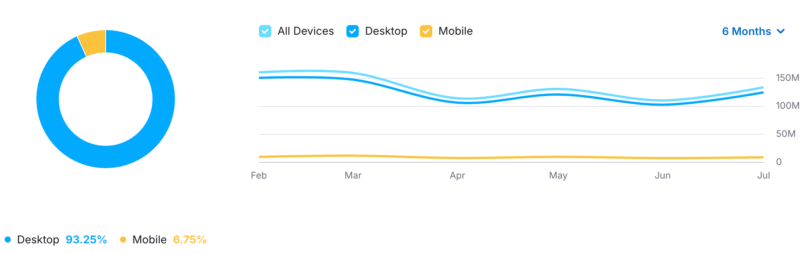

# Проектирование высоконагруженных систем
## Notion

## Содержание
[1. Тема и целевая аудитория](#1-тема-и-целевая-аудитория)

## 1. Тема и целевая аудитория
Notion - это сервис для создания заметок и текстовых документов, канбан-карт, гибких баз данных и баз знаний, трекинга задач и управления проектами.

### Функционал MVP:
- авторизация
- профиль пользователя
- главная страница
- создание и редактирование контента
- совместное редактирование
- поиск по страницам
- недавние и избранные страницы
- вложенные страницы с иерархией
- прикрепление вложений
- автосохранение
- ACL, права доступа

### Целевая аудитория
По данным сайта [hypestat](https://hypestat.com/info/notion.so) Notion имеет следующие метрики:
- более 5 млн уникальных пользователей в день (DAU)
- более 25.5 млн уникальных пользователей в месяц (MAU) и 170 млн сессий в месяц (~7 визитов на пользователя)
- около 20% пользователей заходят в сервис ежедневно (stickness, DAU/MAU)
- среднее время сессии пользователя - 9 минут
- в среднем пользователь за сессию просматривает 11 страниц
- bounce rate сервиса - около 25% пользователей покидают сайт, не совершая никаких взаимодействий

## Анализ аудитории

#### География пользователей

#### Устройства пользователей

## 2. Расчет нагрузки
В 2024 году Notion достиг отметки 100 млн пользователей[^1]. Исходя из этого можно оценить объем сохраняемых данных.

| хранимые данные           | средний размер единицы | ед/пользователь | сколько единиц | суммарный объем  |
|---------------------------|------------------------|:---------------:|----------------|------------------|
| профиль пользователя      | 300 Кб                 |        1        | 100 млн         | 30 Тб            | 
| страницы (без вложений)   | 200 Кб (~25k слов)                 |       10        | 1 млрд        | 200 Тб           |
| вложения                  | 1 Мб                   |       40        | 4 млрд       | 4 Пб           |

## Источники
[^1]: https://www.notion.com/blog/100-million-of-you
